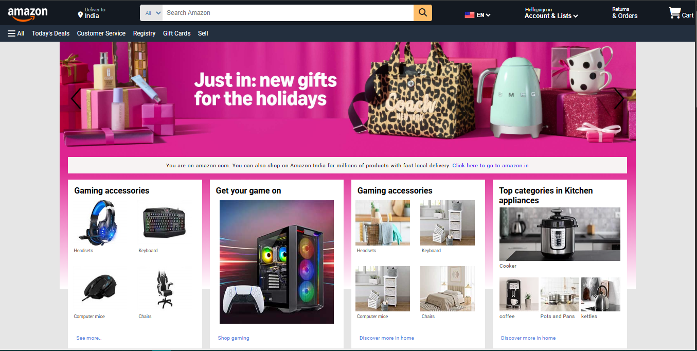

# 🛒 Amazon UI Clone

A  front-end clone of Amazon's homepage, built using **HTML**, **CSS**, and **JavaScript**. This project focuses on replicating the layout, styling, and key visual elements of the Amazon shopping experience.

---

## 📸 Screenshots

  
*(Add your own screenshots in a `screenshots/` folder)*

---

## ✨ Features

- ✅ Amazon-style header with logo, search bar, and cart
- ✅ Product listing sections with cards
- ✅ Hover effects and interactivity using vanilla JS
- ✅ Clean, modular, and semantic HTML/CSS structure

---

## 🛠️ Built With

- **HTML5**
- **CSS3**
- **JavaScript (Vanilla)**

---

## 📁 Folder Structure

amazon-ui-clone/
├── index.html
├── style.css
├── script.js
├── static/
  └── images/
  └── screenshots/

